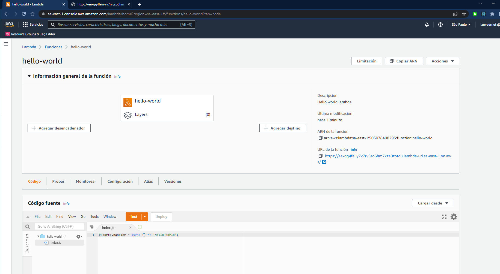
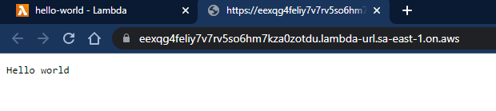

# Assignment

- Create a terraform config with any provider of choice (Docker if you prefer) and share the terraform config files (with .tf extension) and state file (with .tfstate extension)

## Deploy

1. terraform init
2. terraform plan
3. terraform apply

## Results

