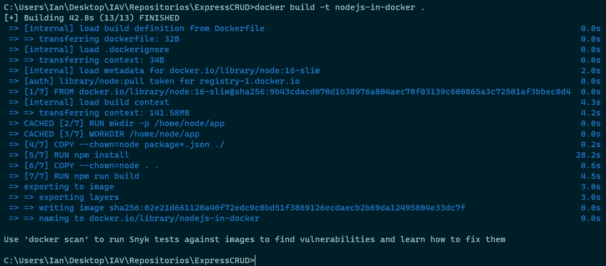
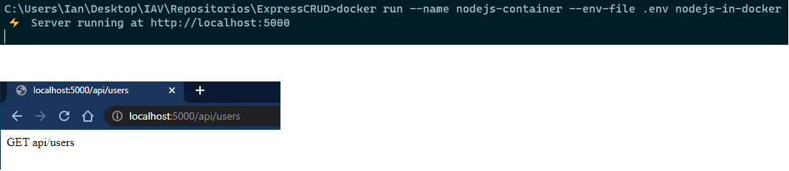

# Tasks

1. Find the primary difference between Docker and Podman
2. Document how to create, build and run a container with a Dockerfile

---

1. The key difference between Docker and Podman lies in architectural design:

- Docker's design is a client-server-based design. It uses a daemon, an ongoing program running in the background, to create images and run containers.
- Podman, on the other hand, directly executes and runs instructions on the system without the need for a daemon to manage the containers.

2. Once you have Docker installed:
   1. Create a Dockerfile with the instructions to build the image. As an example, there is a Dockerfile for a NodeJs app using Typescript in this folder.
   2. Run `docker build -t image-name .`
      
   3. Run `docker run --name container-name image-name`
      
