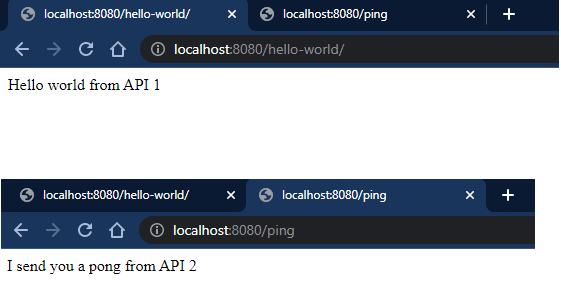

# Assignment

- Investigate about SSL
- Create 2 simple API services which return unique responses
- Use a reverse proxy (either Nginx or Traefik) to route traffic to these API services using path or host based routing
- Please use docker-compose or docker-swarm for this setup

SSL (Secure Sockets Layer) is a protocol used to encrpyt the comunications via internet. This protocol was updated to TLS (Transport Security Layer). SSL/TLS is mainly used to secure communications between clients and servers. In order to secure the communication, asymmetric encryption is used: the client and the server generate each one a key pair and send the public key to each other. After that, each one uses the public key received to encrpyt the data before sending it. Therefore, only who has the private key can decrpyt the data.

## How to test it

- Run `docker compose-up`
- Go to http://localhost:8080/hello-world to get the response from API 1
- Go to http://localhost:8080/ping to get the response from API 2

